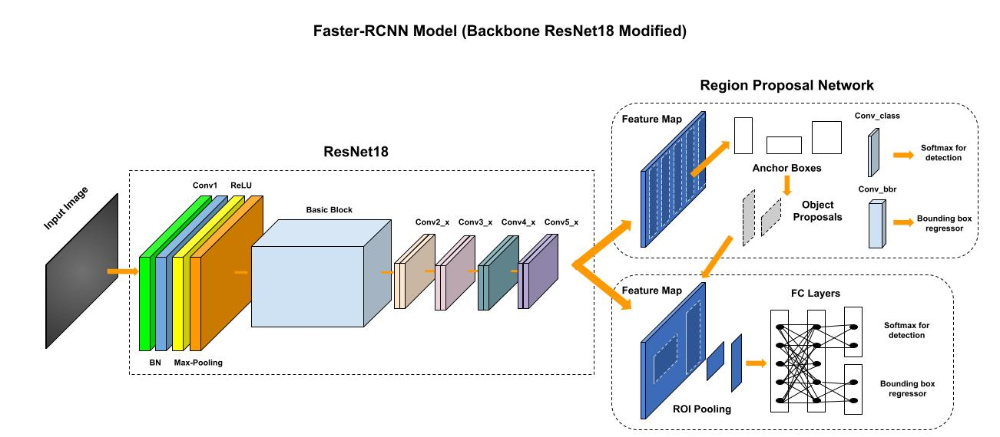
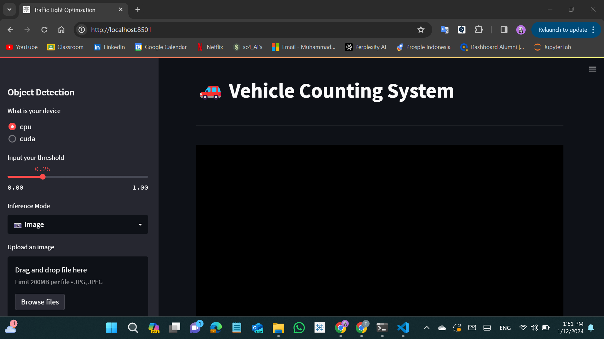

# Traffic Light Optimization using Vehicle Counting & Fuzzy Logic

## Project Description

This project aims to optimize traffic light control at intersections by leveraging object detection, specifically using a modified Faster R-CNN model with a ResNet-18 backbone. The optimization is achieved through the integration of vehicle counting and fuzzy logic to dynamically adjust traffic light timings based on real-time traffic conditions.  

  <figure>
      
      <figcaption>
          Faster R-CNN model with a ResNet-18 backbone
      </figcaption>
  </figure>  

## Features

- Object Detection: Utilizes a Faster R-CNN model with a ResNet-18 backbone to detect and count vehicles at intersections.
- Fuzzy Logic: Implements fuzzy logic to make dynamic decisions for optimizing traffic light timings.
- Real-time Adaptation: The system adapts traffic light timings in real-time based on the detected vehicle count.

## Dataset Sources

The dataset was collected by capturing screenshots from various CCTV points at intersections. These images were then annotated using Roboflow, and augmentation techniques were applied. The dataset comprises two classes: motorcycles and cars.

**CCTV Sources:**
[click here](https://cctv.jogjakota.go.id)

## Model Output

The trained model outputs can be found in the `model/` directory. Below are the links to download the model files:

- [Best Trained Model](https://drive.google.com/drive/folders/1L419RCGY0zDCPojnsGmZsjhzgsRS1UyS?usp=sharing): The best-performing model after training.

## Usage

1. **Installation:**
   - Clone the repository: `git clone https://github.com/mfathul21/vehicle-counting-optim.git`
   - Install dependencies: `pip install -r requirements.txt`
   - Download the model from the Google Drive link provided in the README.md file.

2. **Run the Application:**
   - Navigate to the project directory: `cd vehicle-counting-optim`
   - Run the Streamlit application: `streamlit run main.py`

3. **Input:**
   - For testing purposes, it is recommended to use [CCTV](https://cctv.jogjakota.go.id) images from Pingit 1 Street. 
   - Alternatively, you can use images or videos from the provided `input` folder. Please note that a `mask.png` file has been added to `main.py`, so modification may be required if using other inputs.

4. **Output:**
   - The application will display the optimized traffic light control and relevant statistics, including the count of cars and motorcycles, along with the duration of traffic lights based on fuzzy logic. 

  <figure>
      
  </figure>  

## Contributors

- Muhammad Fathul Radhiansyah (@mfathul21)
- Novia Putri Bahirah (@noviaptr)
- Al Ahmad Syah Huud S. (@alahmadss)

## License

This project is licensed under the [MIT License](LICENSE).
